# Tanzu Mission Control - Access Policies Lab Guide

**Contents:**

- [Tanzu Mission Control - Access Policies Lab Guide](#tanzu-mission-control---access-policies-lab-guide)
  - [Introduction](#introduction)
    - [Before Attempting This Lab:](#before-attempting-this-lab)
    - [Environment Pre-Requisites](#environment-pre-requisites)
  - [Lab Exercises](#lab-exercises)
    - [Step 1 : Open the Policies page](#step-1--open-the-policies-page)
    - [Step 2 : Select the view for applying access policies](#step-2--select-the-view-for-applying-access-policies)
    - [Step 3 : Apply access policies](#step-3--apply-access-policies)
      - [3.1: Apply policies on Organization](#31-apply-policies-on-organization)
        - [3.1.1: View default organization access policies](#311-view-default-organization-access-policies)
        - [3.1.2: Add new role binding to organization](#312-add-new-role-binding-to-organization)
        - [3.1.3 Click on Role arrow to list the valid roles and choose a role:](#313-click-on-role-arrow-to-list-the-valid-roles-and-choose-a-role)
        - [3.1.4 Click on Role arrow to list the valid roles and choose a role:](#314-click-on-role-arrow-to-list-the-valid-roles-and-choose-a-role)
        - [3.1.5 Fill in the User identity and click Add, for more Identities to the same role click on Add for each identity](#315-fill-in-the-user-identity-and-click-add-for-more-identities-to-the-same-role-click-on-add-for-each-identity)
        - [3.1.6: Click "Save" to add the new role binding.](#316-click-%22save%22-to-add-the-new-role-binding)
        - [3.1.7: Edit/Delete existing role binding](#317-editdelete-existing-role-binding)
      - [3.2: Apply policies on Cluster group](#32-apply-policies-on-cluster-group)
        - [3.2.1: View inherited policies from Organization and default direct access policies for cluster group](#321-view-inherited-policies-from-organization-and-default-direct-access-policies-for-cluster-group)
        - [3.2.2: Add/Edit/Delete role bindings on the direct access policy of cluster group](#322-addeditdelete-role-bindings-on-the-direct-access-policy-of-cluster-group)
      - [3.3: Apply policies on Cluster](#33-apply-policies-on-cluster)
        - [3.3.1 Click on cluster name (kind) in left panel under CLUSTERS view in Access Policies panel](#331-click-on-cluster-name-kind-in-left-panel-under-clusters-view-in-access-policies-panel)
        - [3.3.2 View inherited policies from Organization and cluster group.](#332-view-inherited-policies-from-organization-and-cluster-group)
        - [3.3.3 Add/Edit/Delete role bindings on the direct access policy of cluster.](#333-addeditdelete-role-bindings-on-the-direct-access-policy-of-cluster)
      - [3.4: Apply policies on Workspace](#34-apply-policies-on-workspace)
        - [3.4.1 View inherited policies from Organization and default direct access policies for workspace](#341-view-inherited-policies-from-organization-and-default-direct-access-policies-for-workspace)
        - [3.4.2 Add/Edit/Delete role bindings on the direct access policy of workspace.](#342-addeditdelete-role-bindings-on-the-direct-access-policy-of-workspace)
      - [3.5 Apply policies on Namespace](#35-apply-policies-on-namespace)
        - [3.5.1 View inherited policies from Organization, workspace and clustergroup](#351-view-inherited-policies-from-organization-workspace-and-clustergroup)
        - [3.5.2 Add/Edit/Delete role bindings on the direct access policy of namespace.](#352-addeditdelete-role-bindings-on-the-direct-access-policy-of-namespace)
    - [Validate Lab Guide](#validate-lab-guide)

## Introduction

This document is intended to provide a guide to exploring basic usages of access policies in TMC through its UI. 

TMC provides two views to set access policies 

Clusters View
  Access policies can be set at organization, cluster group and clusters level. The policies at a resource  level are 
 1. Inherited Access Policies 
      Policies set at organization gets inherited to all the cluster groups and clusters under the organization.
      Policies set at cluster group gets inherited to all the clusters under the cluster group.

 2. Direct Access policies
      Policies can be applied directly on the Organization, Cluster group and clusters.
Workspaces View
 Access policies can be set at workspace and namespace level.
 1. Inherited Access Policies 
     Policies set at organization gets inherited to all the workspaces and namespaces under it.
     Policies set at workspace gets inherited to all the namespaces under it.

 2. Direct Access policies
      Policies can be applied directly on the workspace and namespace.

### Before Attempting This Lab:

This lab has a completion difficulty of `Partial`. Please see the rubrik below for an explanation of lab completion difficulty rankings

Lab Completion Difficulty Rankings:

- Difficulty Levels:
  - `Complete`
    - A lab guide with a difficulty of `Complete` includes comprehensive, click-by-click instructions, usually with a screenshot for every command entered. `Complete` lab guides must be associated with an online lab environment fully prepped to execute the exact instructions provided in the lab guide. Most users could successfully execute the steps in a `Complete` lab guide, even if they do not have expertise in the subject, by following detailed instructions.
  - `Partial`
    - A lab guide with a difficulty of `Partial` includes full instructions to complete the exercise, with enough detail to where a user with moderate experience in the subject matter could complete the exercise. `Partial` lab guides provide a level of detail similar gto most typical technical documentation, where the user is expected to be able to configure their lab environment with dependencies required for the exercise, and to contextualize general instructions to the users own environment. 
  - `Challenge`
    - A lab guide with a difficulty of `Challenge` is designed to be technically challenging for the guide's target audience to complete. `Challenge` lab guides do not include comprehensive instructions, and intentionally leave out details required to complete exercises as a challenge or test of the users proficiency in a topic.

### Environment Pre-Requisites

The demo in this document is conducted with a development TMC stack in which a Kind cluster is attached.

In order to demonstrate applying and viewing access policies a kind cluster (kind) is attached under the default cluster group and

a namespace (demo-ns) is created under default workspace.

Screenshot

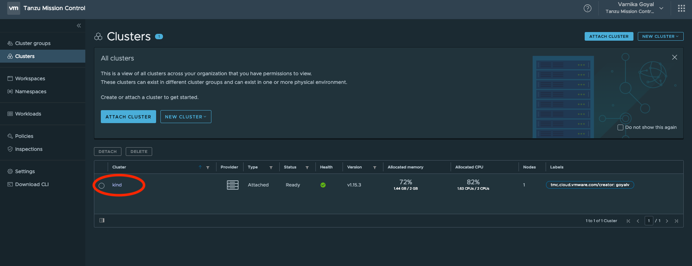

## Lab Exercises

### Step 1 : Open the Policies page

Click on Policies tab on the leftmost panel and choose the Policy Type "Access" from top panel.

Screenshot

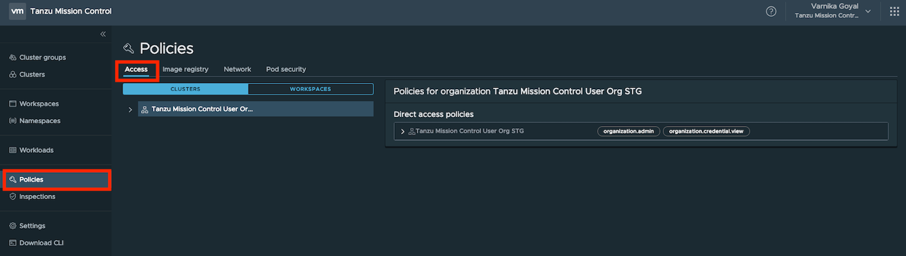

### Step 2 : Select the view for applying access policies

Select CLUSTERS view to apply access policies on the cluster Or Select WORKSPACES view to apply access policies on the namespaces.

### Step 3 : Apply access policies

#### 3.1: Apply policies on Organization

##### 3.1.1: View default organization access policies

- Click on Organization name on left panel under Access Policies.
- Click on organization name under "Direct Access policies" tab on the right to expand Policies to view the role bindings.
  - There is a default policy that is auto applied to all the Organizations, it grants Organization.admin role to all  members of csp:org_owner and  tmc:admin  group and organization.credential.view role to members of csp:org_member group.

Screenshot

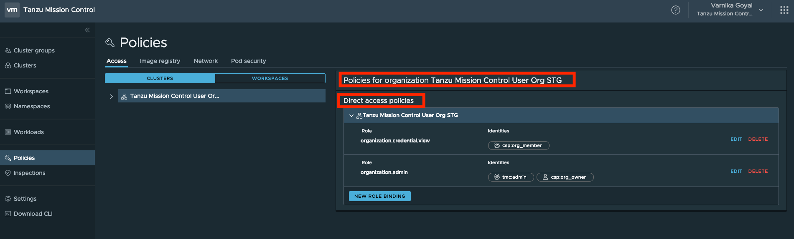

 

##### 3.1.2: Add new role binding to organization

Click on "New Role Binding" button under "DirectAccess Policies" panel. 

Screenshot

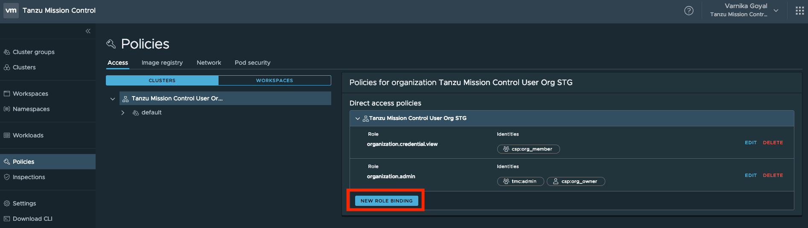

##### 3.1.3 Click on Role arrow to list the valid roles and choose a role:

Screenshot

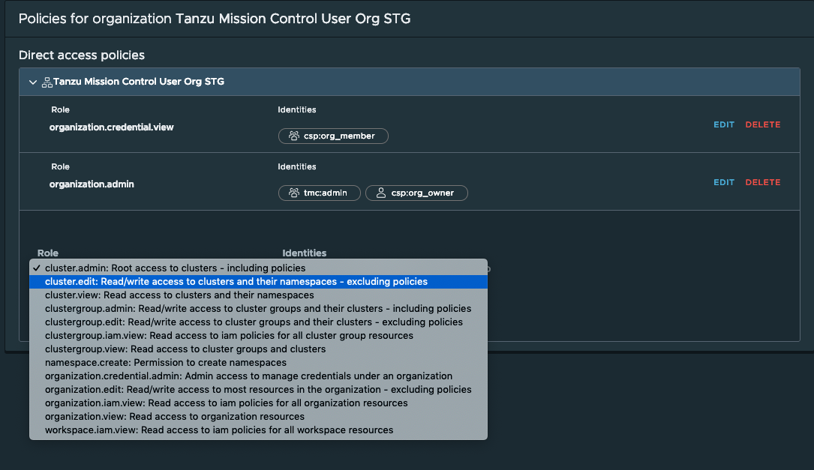

##### 3.1.4 Click on Role arrow to list the valid roles and choose a role:

Screenshot

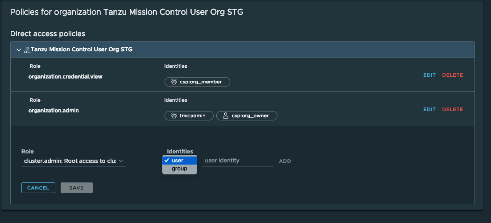

##### 3.1.5 Fill in the User identity and click Add, for more Identities to the same role click on Add for each identity

##### 3.1.6: Click "Save" to add the new role binding.

Screenshot

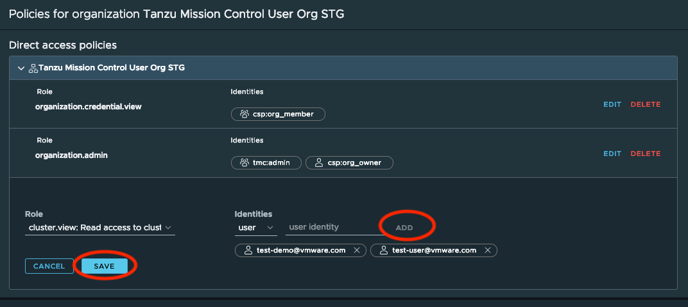

##### 3.1.7: Edit/Delete existing role binding

Click on EDIT button to add/delete user/group identities to a role.

Click on DELETE button to delete a role binding.

#### 3.2: Apply policies on Cluster group

##### 3.2.1: View inherited policies from Organization and default direct access policies for cluster group

- Click on cluster group name (default) in left panel under CLUSTERS view in Access Policies panel
- Click on organization name under "Inherited clustergroups access policies" tab on the right to expand inherited org policies to view the role bindings.
- There is a default cluster group access policy that is auto applied only to the "default" clustergroup , It grants cluster.admin and clustergroup.edit role to all  members of csp:org_member. 
- These default policies are not applied to the user created cluster group.

Screenshot

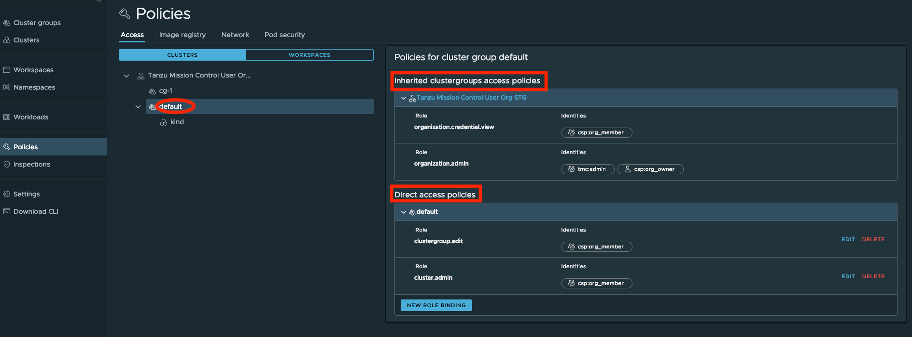

##### 3.2.2: Add/Edit/Delete role bindings on the direct access policy of cluster group

It is similar to the demo steps as of Organization in previous section.

On cluster group level inherited organization policies cannot be changed.

#### 3.3: Apply policies on Cluster

##### 3.3.1 Click on cluster name (kind) in left panel under CLUSTERS view in Access Policies panel

##### 3.3.2 View inherited policies from Organization and cluster group.

Screenshot

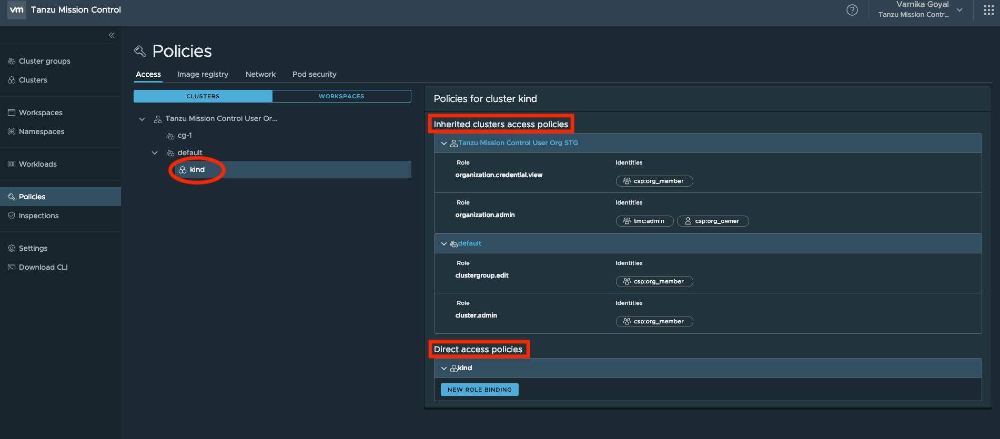

##### 3.3.3 Add/Edit/Delete role bindings on the direct access policy of cluster.

It is similar to the demo steps as of Organization in previous steps

On cluster level inherited organization and cluster group policies cannot be changed.

#### 3.4: Apply policies on Workspace

##### 3.4.1 View inherited policies from Organization and default direct access policies for workspace

- Click on Workspace name(default) on left panel under Access Policies under WORSPACES view tab.
- Click on organization name under "Inherited workspace Access policies" tab on the right to expand Policies to view the role bindings.
- There is a default workspace access policy that is auto applied only to the "default" workspace , It grants workspace.edit role to all  members of csp:org_member.
- These default policies are not applied to the user created workspaces.

Screenshot

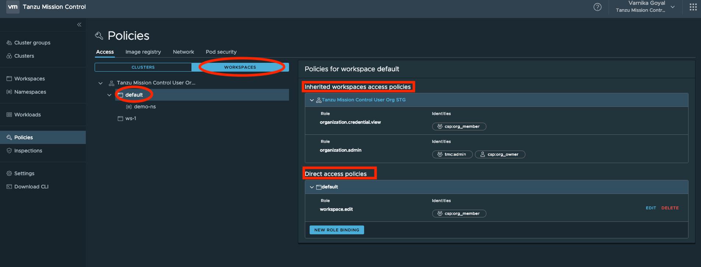

##### 3.4.2 Add/Edit/Delete role bindings on the direct access policy of workspace.

It is similar to the demo steps as of Organization in previous steps

On workspace level inherited organization  policies cannot be changed.

#### 3.5 Apply policies on Namespace

##### 3.5.1 View inherited policies from Organization, workspace and clustergroup

- Click on Namespace name(demo-ns) on left panel under Access Policies under WORSPACES view tab.
- Click on organization name, workspace name(default) clustergroup name(default) under "Inherited namespaces access policies" tab on the right to expand Policies to view the role bindings.

Screenshot

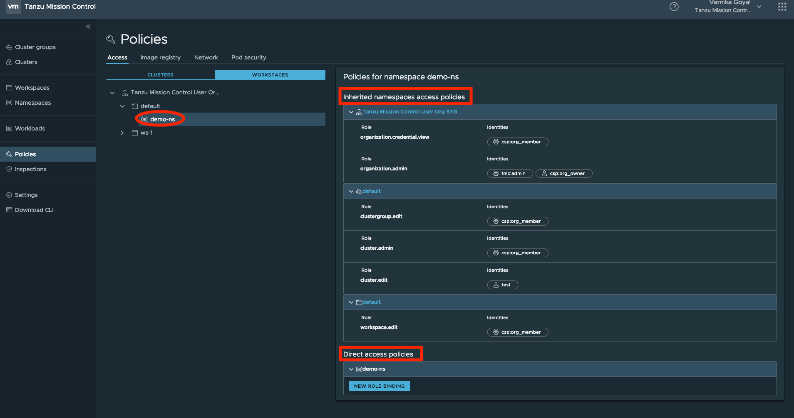

##### 3.5.2 Add/Edit/Delete role bindings on the direct access policy of namespace.

It is similar to the demo steps as of Organization in previous steps

On namespace level inherited organization policies cannot be changed.

### Validate Lab Guide

If you were able to complete this lab successfully without any significant problems, please sign the [validate.md](./validate.md) file located in this directory. 

If you encountered any problems or have suggestions or feature requests, please open an issue ticket on this repository. 

If you have any updates or improvements for this lab guide, please open a PR with your updates.

**Thank you for completing the Tanzu Mission Control - Access Policies Lab Guide!**